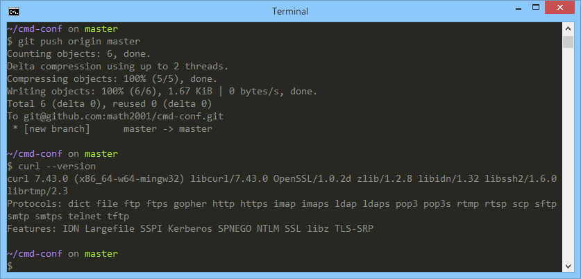

# My `cmd` config

The windows, dare I call it a terminal, is really something ugly and great command free. At least
that's what I thought.

You can customise it using workaround, and the final result is really, in my opinion, great.

Here's how it looks:

Cool, right?

Have a look at the [docs](https://math2001.github.io/cmd-conf) to know how to get that!
